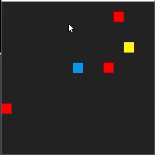

# CPPND: Capstone Dodger Game 

This repo is a fork of the Capstone project in the [Udacity C++ Nanodegree Program](https://www.udacity.com/course/c-plus-plus-nanodegree--nd213). 

In this project, you built my own C++ application by extending provided Snake game, following the principles you have learned throughout the Nanodegree Program. 

## Dependencies for Running Locally
* cmake >= 3.7
  * All OSes: [click here for installation instructions](https://cmake.org/install/)
* make >= 4.1 (Linux, Mac), 3.81 (Windows)
  * Linux: make is installed by default on most Linux distros
  * Mac: [install Xcode command line tools to get make](https://developer.apple.com/xcode/features/)
  * Windows: [Click here for installation instructions](http://gnuwin32.sourceforge.net/packages/make.htm)
* SDL2 >= 2.0
  * All installation instructions can be found [here](https://wiki.libsdl.org/Installation)
  * Note that for Linux, an `apt` or `apt-get` installation is preferred to building from source.
* gcc/g++ >= 5.4
  * Linux: gcc / g++ is installed by default on most Linux distros
  * Mac: same deal as make - [install Xcode command line tools](https://developer.apple.com/xcode/features/)
  * Windows: recommend using [MinGW](http://www.mingw.org/)

## Basic Build Instructions

1. Clone this repo.
2. Make a build directory in the top level directory: `mkdir build && cd build`
3. Compile: `cmake .. && make`
4. Run it: `./DodgerGame`.

## Basic Gameplay Instructions 
The blue point is your actor, it can be controlled via arrow keys and it never stops. 
The red points are enemies which you should avoid unless you want to lose the game. 
There're also yellow points being generated - those are tresures and you should get as many of them as you can, since they will increase your score.
Have fun!

## Project Rubric Points
This project meets the project rubric points 

### Loops, Functions, I/O
* The project demonstrates an understanding of C++ functions and control structures.
* The project accepts user input and processes the input.

### Object Oriented Programming
* The project uses Object Oriented Programming techniques. 
* Classes use appropriate access specifiers for class members.
* Class constructors utilize member initialization lists.
* Classes abstract implementation details from their interfaces.
* Classes encapsulate behavior.

### Memory Management
* The project makes use of references in function declarations.
* The project uses destructors appropriately.
* The project uses scope / Resource Acquisition Is Initialization (RAII) where appropriate.
* The project uses smart pointers instead of raw pointers.

### Concurrency
* The project uses multithreading.
* A mutex or lock is used in the project.
